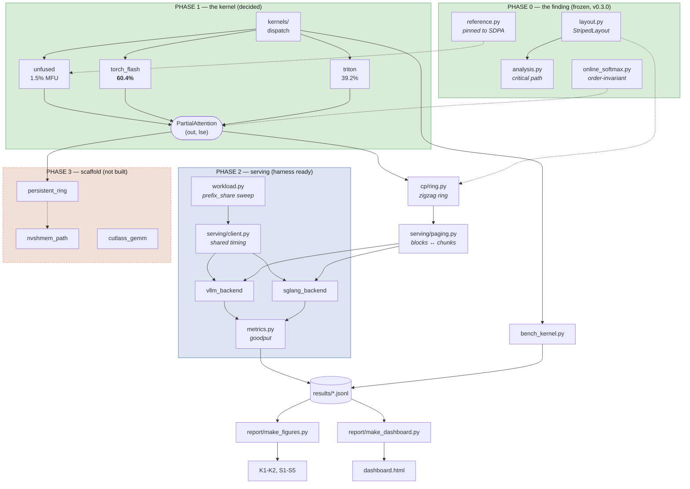

# Pipeline

How data moves through this project, what each phase is for, and what state each
one is in. Complements `docs/ARCHITECTURE.md` in the upstream repo, which covers
module layering; this covers **the flow from tensors to published figures**.

## The whole thing



Dotted edges are *constraints* rather than data: the layout tells the ring which
chunks a device owns, the reference is what the oracle is diffed against.

## The one contract everything rests on

```
flash_attention(q, k, v, causal, q_offset, k_offset) -> PartialAttention(out, lse)
```

Every backend returns this. That single decision is why the serving stack, the
CP ring, and the Phase 3 kernels could all be written and CI-tested on a laptop
against `unfused`, then run unchanged on a GPU against `torch_flash`. Phase 1
proved it holds: the same tests passed across all three backends with no edit.

`lse` is the load-bearing half. Without it a partial result cannot be merged
with another, and context parallelism is impossible — which is why the public
`scaled_dot_product_attention` is unusable here and `torch_flash` reaches for
the private aten op that returns it.

## Phase by phase

### Phase 0 — the finding (frozen)

**Purpose:** establish that striped assignment fixes causal load imbalance.
**Data:** pseudo-random tensors, `N(0,1)`, seeded. No dataset — attention has no
data-dependent control flow, so cost is set by shape, not content.
**Output:** 1.73× at S=131072, 99.1% of the `2−1/P` bound; 1M-token prefill.
**State:** frozen at v0.3.0, consumed here as the `dattn` dependency.

### Phase 1 — the kernel (decided)

**Purpose:** the upstream result was measured on a kernel at 2.5–3.4% of peak.
Any serving number built on that would have to be re-run, so the kernel had to
be settled first.

| in | out |
|---|---|
| `[B, H, S, D]` bf16 tensors | `PartialAttention(out, lse)` |
| | `results/kernel.jsonl` — 13 rows |
| | `results/triton_validation.json` |

**Decision:** Triton validated at 39.2% MFU (24× over unfused, clears the 20%
gate); `torch_flash` at 60.4% stays the default. Written up in `docs/PHASE1.md`.
**Cost:** $0.30 on 1× A100.

### Phase 2 — serving (harness ready, unmeasured)

**Purpose:** does zigzag CP help a real serving system, and where does
RadixAttention start paying for itself?

```
WorkloadSpec(prefix_share) → generate() → Workload
    → client.send() → [TokenStream] → [RequestRecord]
    → summarize() → ServingMetrics → results/serving.jsonl
    → S1-S5 + dashboard
```

**Data:** prompts from vLLM's own samplers where installed, with
`prefix_share ∈ {0, .25, .5, .75, .9, 1}` as the independent variable. Greedy
decoding, fixed output length, `ignore_eos` — so decode-step count cannot vary
for reasons unrelated to the system under test.
**Headline metric:** goodput, not throughput. A system can post excellent
throughput while missing latency targets on most requests; goodput cannot.
**State:** every box above exists and is tested. `results/serving.jsonl` is
empty — nothing has been measured. Two `NotImplementedError` hooks remain
(`sample_block_table`, `request_intervals`) because they reach into
version-specific engine internals.

### Phase 3 — scaffold (not built)

**Purpose:** persistent CUDA ring → NVSHMEM decode → CUTLASS comparison, in that
order. The first is a prerequisite for the second: device-initiated fetch needs
a resident kernel to fetch into.
**Gate:** NVSHMEM is scoped to *decode only*, because measurement showed
communication is 1.1% of prefill runtime. A test fails if it appears on the
prefill path.

## Where the data lives

| File | Contents | State |
|---|---|---|
| `results/kernel.jsonl` | 13 rows, A100 bf16, 3 backends × 5 seq | **measured** |
| `results/triton_validation.json` | the six-step validation record | **measured** |
| `results/environment.txt` | GPU, driver, torch, triton, capability | **measured** |
| `results/serving.jsonl` | prefix-share sweep | **empty — Phase 2** |

Every figure regenerates from these through the same functions the dashboard
uses, so a fabricated table disagrees with its own figure. `make report` deletes
`report/figures/` first: if a number was ever typed rather than measured, that
is where it surfaces.

## The rule that shapes the code

**Nothing simulates.** `bench/serving.py` raises rather than inventing numbers
when no engine is installed. `make_client` refuses the CP configurations rather
than building a non-CP engine under a CP name. Figures skip when their inputs
are absent rather than drawing from placeholder data. Test doubles exist, but
only inside test files, and no path writes their output to `results/`.

The reason is narrow: a simulated number and a measured one look identical once
they reach a plot, and nothing downstream can tell them apart.
